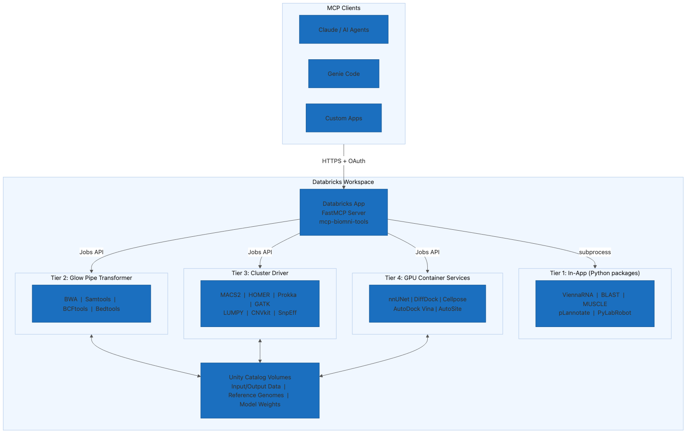

# Biomni MCP Server for Databricks

An MCP (Model Context Protocol) server that exposes 18 bioinformatics CLI tools as a Databricks App. Any AI agent on Databricks — including Genie Code, Claude, or custom agents — can call these tools via the MCP protocol with OAuth authentication.

Built on the tool inventory from the [Biomni](https://github.com/snap-stanford/Biomni) project.



## Tools

13 MCP tools covering 18 bioinformatics CLI binaries across 4 execution tiers:

| Tool | What it does | Tier |
|------|-------------|------|
| `predict_rna_secondary_structure` | RNA folding + MFE via ViennaRNA | 1 - In-App |
| `annotate_plasmid` | Plasmid annotation via pLannotate | 1 - In-App |
| `analyze_protein_conservation` | Multiple sequence alignment via BioPython | 1 - In-App |
| `analyze_protein_phylogeny` | Neighbor-joining phylogenetic trees | 1 - In-App |
| `blast_sequence` | NCBI BLAST sequence search (remote API) | 1 - In-App |
| `test_pylabrobot_script` | Lab robot simulation via PyLabRobot | 1 - In-App |
| `run_alignment_pipeline` | BWA / Samtools / BCFtools / Bedtools via Glow | 2 - Spark |
| `run_chipseq_analysis` | MACS2 peak calling + HOMER motif finding | 3 - Cluster |
| `run_somatic_mutation_pipeline` | GATK Mutect2 + SnpEff annotation | 3 - Cluster |
| `run_structural_variant_analysis` | LUMPY SV detection + CNVkit copy number | 3 - Cluster |
| `annotate_bacterial_genome` | Prokka bacterial genome annotation | 3 - Cluster |
| `run_medical_imaging` | nnUNet / Cellpose segmentation | 4 - GPU |
| `run_molecular_docking` | DiffDock / AutoDock Vina / AutoSite | 4 - GPU |

### Execution Tiers

- **Tier 1 (In-App):** Runs instantly in the app container using Python packages. No cluster needed.
- **Tier 2 (Glow Pipe):** Distributed execution on Spark via the Glow Pipe Transformer. For stdin/stdout-compatible tools.
- **Tier 3 (Cluster Driver):** Runs on the cluster driver node via subprocess. For file-based genomics tools.
- **Tier 4 (GPU):** Runs on a GPU cluster with Container Services. For deep learning tools (nnUNet, DiffDock, Cellpose).

## Quick Start

### Prerequisites

- Databricks workspace with Apps enabled
- [Databricks CLI](https://docs.databricks.com/dev-tools/cli/install.html) configured
- Python 3.11+

### Deploy

```bash
git clone https://github.com/vb-dbrks/biomni-mcp-server.git
cd biomni-mcp-server

# Validate the bundle
databricks bundle validate

# Deploy to your workspace
databricks bundle deploy -t dev

# Start the app
databricks bundle run biomni_mcp -t dev
```

The app will be available at `https://mcp-biomni-tools-<workspace-id>.azuredatabricksapps.com`.

### Connect from Genie Code

1. Open Genie Code in your Databricks workspace
2. Click the MCP tools icon
3. Select **mcp-biomni-tools** (the `mcp-` prefix makes it discoverable)
4. Try a query:

> Predict the secondary structure of this RNA sequence: GGGAAACCCUUUAAAGGGCCC

### Try It Out

**Tier 1 tools work immediately** with no additional setup:

| Try this | Tool used |
|----------|-----------|
| "Predict the secondary structure of this RNA: AUGCUAGCUAGCUAGC" | ViennaRNA |
| "Search for proteins similar to: MVLSPADKTNVKAAWGKVGAHAGEYGAEALERMFLSFPTTKTYFPHFDLSH" | BLAST |
| "What is the MFE of GGGAAACCCUUUAAAGGGCCC at 42 degrees?" | ViennaRNA |
| "Run a blastn search against nt for: ATGCGATCGATCGATCGATCG" | BLAST |

**Tier 2-4 tools** require cluster configuration (see below).

## Configuration

### Cluster Setup (Tier 2/3/4)

For tools that run on clusters, set the cluster IDs in `app.yaml`:

```yaml
env:
  - name: SPARK_CLUSTER_ID
    value: "<your-standard-cluster-id>"
  - name: GPU_CLUSTER_ID
    value: "<your-gpu-cluster-id>"
```

**Standard cluster** (Tier 2 + 3): Install bioinformatics tools via init script:

```bash
# Upload the init script to your workspace
databricks fs cp cluster_scripts/init_genomics_tools.sh dbfs:/init-scripts/

# Configure the cluster to use it as an init script
```

**GPU cluster** (Tier 4): Build and push the Container Services image:

```bash
./scripts/build_gpu_image.sh <your-container-registry-url>
```

### Unity Catalog Volumes (Tier 2/3/4)

Cluster-based tools read/write data from UC Volumes:

```bash
# Create the catalog, schema, and volumes
./scripts/setup_volumes.sh
```

Default volume layout:
```
/Volumes/bioinformatics/tools/workspace_files/   # Input/output data
/Volumes/bioinformatics/tools/reference_data/    # Genomes, models, annotations
```

## Development

```bash
# Install with dev dependencies
pip install -e ".[dev]"

# Run tests (40 tests)
pytest tests/ -v

# Validate bundle config
databricks bundle validate
```

## Project Structure

```
biomni-mcp-server/
├── main.py                     # FastMCP server entry point
├── app.yaml                    # Databricks App runtime config
├── databricks.yml              # DAB bundle config (dev/prod targets)
├── requirements.txt            # Python dependencies
├── src/
│   ├── config.py               # Environment-based configuration
│   ├── file_io.py              # Volume file helpers
│   ├── job_runner.py           # Databricks Jobs API wrapper
│   ├── tool_wrapper.py         # Safe subprocess + result formatting
│   ├── validation.py           # Input validation (sequences, paths)
│   └── tools/                  # MCP tool definitions by tier
├── runner/                     # Cluster-side execution package
├── notebooks/                  # Parameterized Databricks notebooks
├── cluster_scripts/            # Init scripts for tool installation
├── docker/                     # GPU Dockerfile (Tier 4 only)
├── scripts/                    # Deployment + setup scripts
└── tests/                      # Unit tests (40 passing)
```

## Key Design Decisions

- **No custom Docker for the app.** Databricks Apps don't support Dockerfiles. Tier 1 tools use pip-installable Python packages (ViennaRNA, BioPython) instead of system binaries.
- **Init scripts for Tier 2/3.** Bioinformatics CLI tools (BWA, GATK, etc.) are installed via cluster init scripts, not custom Docker — following Databricks best practices.
- **Container Services only for GPU.** Custom Docker is reserved for Tier 4 where CUDA + ML frameworks make init scripts impractical.
- **Stateless HTTP mode.** The MCP server runs in stateless mode with JSON responses for compatibility with Genie Code.
- **13 tools (under 15-tool limit).** Genie Code has a 15-tool limit. Related tools are consolidated (e.g., BWA + Samtools + BCFtools + Bedtools = 1 tool with a `tool` parameter).

## Citation

This project builds on the tool inventory and approach from the Biomni project. If you use this work, please cite:

```bibtex
@article{huang2025biomni,
  title={Biomni: A General-Purpose Biomedical AI Agent},
  author={Huang, Kexin and Zhang, Serena and Wang, Hanchen and Qu, Yuanhao and Lu, Yingzhou and Roohani, Yusuf and Li, Ryan and Qiu, Lin and Zhang, Junze and Di, Yin and others},
  journal={bioRxiv},
  pages={2025--05},
  year={2025},
  publisher={Cold Spring Harbor Laboratory}
}
```

See the [Biomni repository](https://github.com/snap-stanford/Biomni) for the original project. Note that while this MCP server is Apache 2.0 licensed, individual integrated tools may carry their own licenses — see the Biomni repository's `license_info.md` for details.

## License

Apache 2.0
